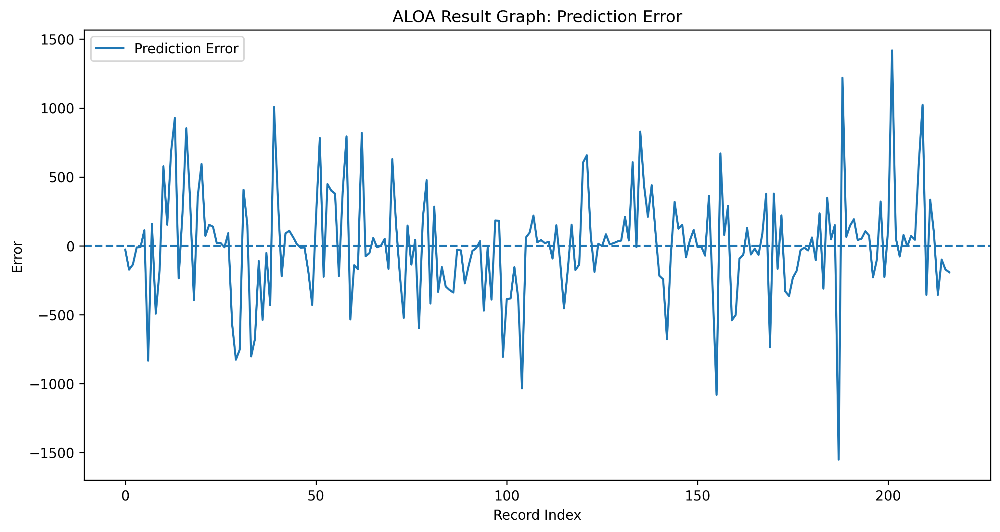

# 🏗️ Steel Price Forecasting System  

## 🧠 Predicting Steel Prices using Machine Learning & Bio-Inspired Optimization   

---

## 👤 Author

**Sagnik Patra**

---

## 📌 Project Overview

This project builds an end-to-end **Steel Price Forecasting System** using Machine Learning and Bio-Inspired Optimization Algorithms.

The system analyzes historical steel price data, performs feature engineering, applies optimization-based feature selection, and predicts steel prices using optimized machine learning models.

The project automatically generates:

- Prediction CSV files
- Result CSV files
- Model files
- Configuration files
- Accuracy reports
- Visualization graphs
- Heatmaps
- Optimization progress graphs

---



---

## 🎯 Objectives

- Analyze steel price trends
- Predict future steel prices using machine learning
- Perform feature engineering on steel market data
- Optimize feature selection using bio-inspired algorithms
- Generate prediction and result reports
- Save trained models and configuration files
- Visualize steel price forecasting performance

---

## ⚙️ Tech Stack

- Python
- Pandas
- NumPy
- Scikit-learn
- TensorFlow / Keras
- Matplotlib
- Seaborn
- Joblib
- YAML
- JSON

---

## 🧬 Optimization Algorithms Used

- AIS - Artificial Immune System
- CSA - Crow Search Algorithm
- PSO - Particle Swarm Optimization
- QPSO - Quantum Particle Swarm Optimization
- BA - Bat Algorithm
- ALOA - Ant Lion Optimization Algorithm

---

## 📂 Dataset

```text
Rajya_Sabha_Session_237_AU1254_1.1.csv
